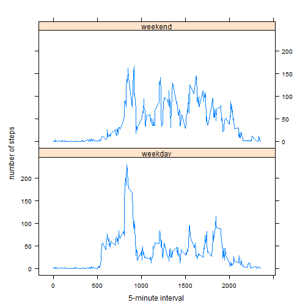

##Loading and preprocessing the data


1. Load the data


```r
activity = read.csv("activity.csv", as.is = TRUE)
```

2. Process/transform the data (if necessary) into a format suitable for your analysis


```r
totalSteps <- aggregate(steps ~ date, data = activity, sum, na.rm = TRUE)
```

##What is mean total number of steps taken per day?

1. Calculate the total number of steps taken per day


```r
steps_per_day <- aggregate(steps ~ date, totalSteps, sum)
```

2. If you do not understand the difference between a histogram and a barplot, research the difference between them. Make a histogram of the total number of steps taken each day


```r
hist(steps_per_day$steps, main = "Histogram of total number of steps per day", xlab = "Steps per day")
```

 

3. Calculate and report the mean and median of the total number of steps taken per day

- mean

```r
round(mean(steps_per_day$steps))
```

```
## [1] 10766
```

- median

```r
median(totalSteps$steps)
```

```
## [1] 10765
```

##What is the average daily activity pattern?

1. Make a time series plot (i.e. type = "l") of the 5-minute interval (x-axis) and the average number of steps taken, averaged across all days (y-axis)


```r
stepsInterval <- aggregate(steps ~ interval, data = activity, mean, na.rm = TRUE)
plot(steps ~ interval, data = stepsInterval, type = "l", col=1, main="Average number of steps by Interval", xlab="Time Intervals", ylab="Average number of steps")
```

 

2. Which 5-minute interval, on average across all the days in the dataset, contains the maximum number of steps?


```r
stepsInterval[which.max(stepsInterval$steps), ]$interval
```

```
## [1] 835
```


**ANSWER:** It is the 835th 5-minute interval.

##Imputing missing values

1. Calculate and report the total number of missing values in the dataset (i.e. the total number of rows with NAs)


```r
sum(is.na(activity$steps))
```

```
## [1] 2304
```


**ANSWER:** The total number of rows with NAs: 2304

2. Devise a strategy for filling in all of the missing values in the dataset. The strategy does not need to be sophisticated. For example, you could use the mean/median for that day, or the mean for that 5-minute interval, etc.

**STRATEGY:** Filling in all of the missing values with the mean for that 5-minute interval. First I created the following function to get the mean steps for particular 5-minute interval.


```r
meanStepsIn5minInterval <- function(interval) {
        stepsInterval[stepsInterval$interval == interval, ]$steps
}
```

3. Create a new dataset that is equal to the original dataset but with the missing data filled in.


```r
activityFilled <- activity
count = 0 
for (i in 1:nrow(activityFilled)) {
        if (is.na(activityFilled[i, ]$steps)) {
            activityFilled[i, ]$steps <- meanStepsIn5minInterval(activityFilled[i, ]$interval)
            count = count + 1
    }
}
```

**2304 NA values were filled.**

4. Make a histogram of the total number of steps taken each day and Calculate and report the mean and median total number of steps taken per day. Do these values differ from the estimates from the first part of the assignment? What is the impact of imputing missing data on the estimates of the total daily number of steps?


```r
totalStepsNoNAs<- aggregate(steps ~ date, data = activityFilled, sum)
hist(totalStepsNoNAs$steps, main = "Histogram of total number of steps per day", xlab = "Steps per day")
```

 

- mean

```r
round(mean(totalStepsNoNAs$steps))
```

```
## [1] 10766
```

- median

```r
median(totalStepsNoNAs$steps)
```

```
## [1] 10766.19
```

**ANSWER:** There is no significant difference between these values (based on the filled dataset) and the estimates from the first part of the assignment. We can say that, imputing of missing values makes no impact on the estimates of the total daily number of steps.

##Are there differences in activity patterns between weekdays and weekends?

1. Create a new factor variable in the dataset with two levels – “weekday” and “weekend” indicating whether a given date is a weekday or weekend day.


```r
activityFilled$day = ifelse(as.POSIXlt(as.Date(activityFilled$date))$wday%%6 == 
        0, "weekend", "weekday")
# For Sunday and Saturday : weekend, Other days : weekday
activityFilled$day = factor(activityFilled$day, levels = c("weekday", "weekend"))
```

2. Make a panel plot containing a time series plot (i.e. type = "l") of the 5-minute interval (x-axis) and the average number of steps taken, averaged across all weekday days or weekend days (y-axis).


```r
stepsIntervalNoNAs = aggregate(steps ~ interval + day, activityFilled, mean)
library(lattice)
xyplot(steps ~ interval | factor(day), data = stepsIntervalNoNAs, aspect = 1/2, 
    type = "l", xlab="5-minute interval", ylab="number of steps")
```

 
